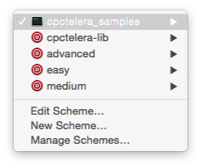
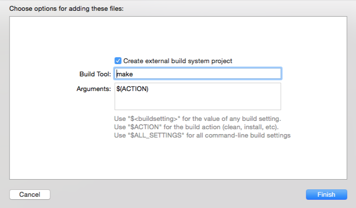

# cpctelera-samples-Xcode

Open, edit, build & run [CPCtelera](https://github.com/lronaldo/cpctelera) samples from the comfort of Xcode

## What is this CPCtelera about?

[CPCtelera](https://github.com/lronaldo/cpctelera) is a library & toolchain to create games for the Amstrad family of computers. CPCtelera tries to be plattform-agnostic and currently runs on Windows, Linux & OS X. You can use whatever code editor that suits you. In my case, as Mac developer, this editor is Xcode

## Installing

Just clone this repo in the folder that contains the CPCtelera folder, so that CPCtelera & this repo are siblings. You must end with a folder structure like this one:


```
MyFolderForAmstradDevelopment
|
|--- cpctelera
|--- cpctelera_samples_xcode

```

## Using

Open cpctelera_samples.xcodeproj & hit Cmd + B (build). To clean all targets, do a clean in Xcode (Cmd + K).

You can build all examples (select cpctelera_samples Scheme) or easy, medium & advanced examples (click the Schemes menu, then select the desired Scheme)




Using different Schemes in Xcode allows you to build (Cmd + B), clean (Shift + Cmd + K) or run (Cmd + R) every group of samples. 

Running does nothing right now, but you can open the Arnold Emulator if you whish

## Xcode & CPCTelera projects

CPCTelera projects are regular C projects that use a Makefile to hold all config. If you want to use Xcode as your IDE for any CPCTelera project, just:
- create a new Project in Xcode, select OS X > Command Line Tool. That's the simplest project you can have.
- drag the folder containing your project inside Xcode. It will show a window telling you it's going to use "external build system". Change `/usr/bin/make` for `make` 



## License

GPL v2, as everything else in cpctelera & tools (mostly)